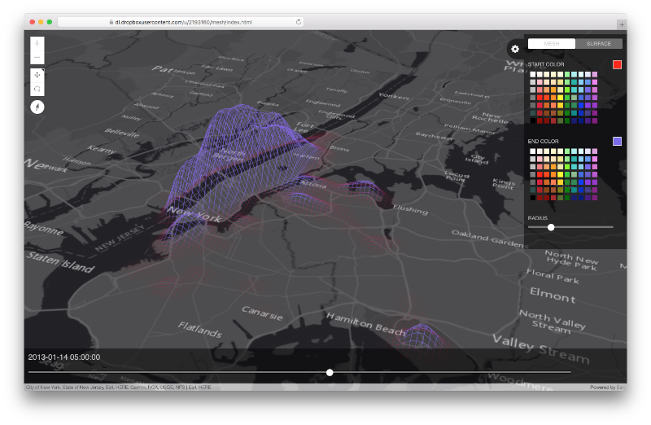
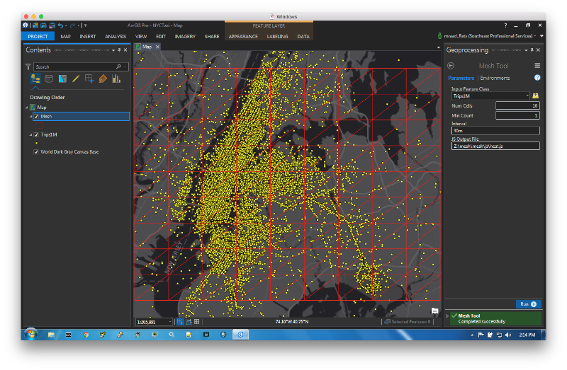
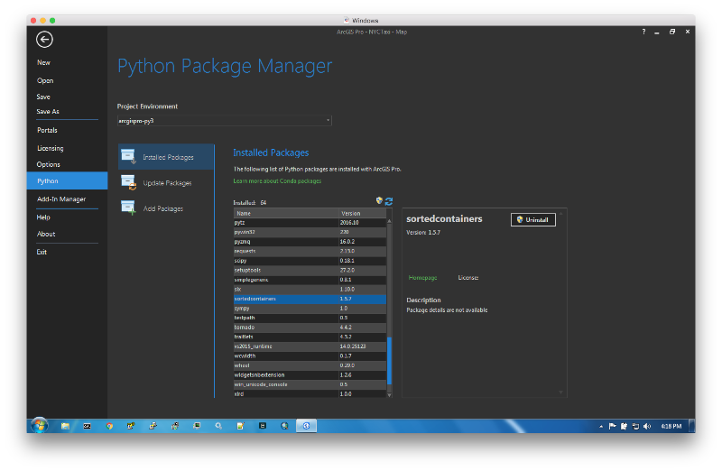
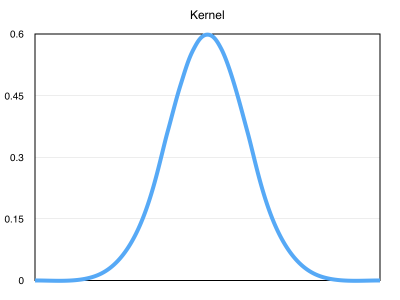
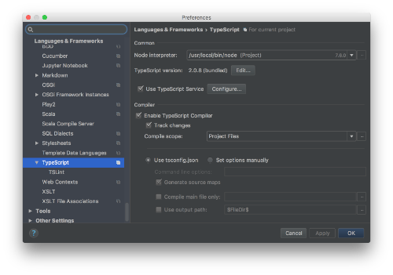

# Mesh Application

Start by viewing [this application](https://dl.dropboxusercontent.com/u/2193160/mesh/index.html).



Make sure to tilt the map by holding down the right mouse button and sliding the mouse up. Then, slide the bottom slider back and forth to see the data "ripple" through time. This is displaying the density of 1 million NYC taxi pickup over a time period aggregated over 30 minute interval. This application is based on the new [4.2 ArcGIS API for JavaScript](https://developers.arcgis.com/javascript/) and specifically on the [externalRenderers](https://developers.arcgis.com/javascript/latest/api-reference/esri-views-3d-externalRenderers.html) capabilities, where a JS application can delegate the rendering to custom [WebGL](https://www.khronos.org/webgl/) code.

This project is divided into 2 sub-projects:

- An [ArcPy](http://pro.arcgis.com/en/pro-app/arcpy/get-started/what-is-arcpy-.htm) based [Pro](https://pro.arcgis.com/en/pro-app/) toolbox to aggregate and prepare the data.
- A JavaScript application to view the prepared data.

## Mesh Toolbox



This tool bins over space and time the input point features to produce on the local file system a "space-time-cube" in the form of a [DOJO AMD Module](http://dojotoolkit.org/documentation/tutorials/1.10/modules/).  The following is a very simplistic output, but demonstrates the module content.

```
define({
    "mesh": {
        "ymax": 40.86254766648426,
        "xmin": -74.0984483274695,
        "ymin": 40.632320706393344,
        "cols": 2,
        "rows": 2,
        "vertices": [-74.0984483274695, 40.86254766648426, 100, -73.69913039514432, 40.86254766648426, 100, -74.0984483274695, 40.632320706393344, 100, -73.69913039514432, 40.632320706393344, 100],
        "xmax": -73.69913039514432,
        "indices": [1, 0, 2, 2, 3, 1],
        "length": 4
    },
    "data": {
        "min": 980557.0,
        "stddev": 0.0,
        "max": 980557.0,
        "mean": 980557.0,
        "data": [{"datetime": "2012-12-21 00:00:00", "points": [{"w": 0.2, "r": 1, "p": 980557, "c": 0}]}]
    }
});
```

The `mesh` property has the world extent (`xmin`,`ymin`,`xmax`,`ymax`) of the mesh based on the map current extent, and defines the vertices of the nodes forming the mesh as a sequence of triples (lon,lat,elevation). WebGL renders the mesh as a sequence of triangles using the [WebGLRenderingContext.drawElements()](https://developer.mozilla.org/en-US/docs/Web/API/WebGLRenderingContext/drawElements) where the `mode` is set to `gl.TRIANGLES`. The `drawElements` uses the `indicies` and the "converted" (more on this later) `vertices` to draw efficiently and quickly the triangles.

The `data` property defines the space-time-cube. During the module preparation, the input features are binned by space using their geometry into rows and column tuples and by time using their temporal attribute into interval buckets. In addition, the `mean` and `stddev` of the bin counts are calculate using an [online variance](https://en.wikipedia.org/wiki/Algorithms_for_calculating_variance). The values `min` and `max` values are derived using `mean` &#177; `stddev` and used to weight the bin count (`p`) and produce a weight `w` &#8712; \[0,1\] in the subsequently defined `points` elements.
The `data` sub-property is an array of objects sorted by `datetime` interval buckets and contain a `points` sub-property.  The latter is an array of objects with population bin count values (`p`) for a mesh row (`r`) and column (`c`) vertex.

So for each time interval bucket, the mesh vertices are "elevated" and color coded in proportion to their `w` point value.

The Interval parameter in the tool accepts a string in the form of a number followed by either a `s` (seconds), `m` (minutes), `d` (days), `w` (weeks). So a string value of `30s` means an interval of 30 seconds, and a string value of `2d` means an interval of 2 days.

This tool depends on [SortedContainers](http://www.grantjenks.com/docs/sortedcontainers/), so make sure to use `Add Packages` to add the library to your Pro Python environment.



## JavaScript Application

The generated space-time cube JavaScript code is loaded at startup time into the application as an AMD module and is rendered using the [4.2 ArcGIS API for JavaScript](https://developers.arcgis.com/javascript/) with the experimental [externalRenderers](https://developers.arcgis.com/javascript/latest/api-reference/esri-views-3d-externalRenderers.html) which enables the application to invoke [WebGL](https://www.khronos.org/webgl/) [shaders](https://webglfundamentals.org/webgl/lessons/webgl-shaders-and-glsl.html). The shaders are compiled and initialized in the `setup` function of an `externalRenderer` instance and continuously invoked in the `render` function.

The following is a snippet in the `render` function:

```
var camera = context.camera;
gl.uniformMatrix4fv(this.pMatrixUniform, false, camera.projectionMatrix);
gl.uniformMatrix4fv(this.vMatrixUniform, false, camera.viewMatrix);

externalRenderers.toRenderCoordinates(
    this.view,
    this.vertices,
    0,
    SpatialReference.WGS84,
    this.arrPosition,
    0,
    appMesh.length);
```

Note how we are taking advantage to the `camera` projection matrix and view matrix properties to populate the vertex shader `uPMatrix` and `uVMatrix` uniforms used in the `gl_Position` calculation. In addition, and this is SOOOO USEFUL, note the usage of the `toRenderCoordinates(...)` function that converts the mesh vertices world coordinates to WebGL coordinates based on the camera position.

The application enables the user to drag back and forth a slider where the slider position is an index into the space-time cube `data.data` array, where all the `points` associated with that "datetime" will be mapped to the mesh vertices and elevated.
The vertex elevation is proportional to the `w` value of a point. In addition, all the neighboring vertices are also elevated, but in proportion to a kernel distance function providing a smooth elevated surface.



To view the application, place the `mesh` folder in your web server or you can start a simple web server in the `mesh` folder:

```
python -m SimpleHTTPServer 8000
```

Open a browser (preferably Chrome) and navigate to <http://localhost:8000/index.html>

### TypeScript

Note that the kernel elevation is occurring in the `kernel.ts` code writen in [TypeScript](https://www.typescriptlang.org/).  I have to confess that is a bit selfish on my part for "mixing" languages, as JavaScript is not my favorite language, and I long for the days when I used to write statically typed [AS3](https://en.wikipedia.org/wiki/ActionScript) code. Typescript is pretty cool, has great community support and we at Esri have made significant investments in supporting it. Check out [this](https://github.com/Esri/jsapi-resources/tree/master/4.x/typescript) github repo to setup your development environment.
In addition, it is **HIGHLY** recommended to use an IDE like [IntelliJ](https://www.jetbrains.com/idea/) or [WebStorm](https://www.jetbrains.com/help/webstorm/2016.3/typescript-support.html) with TypeScript support If you need to modify the `js/kernel.ts` file.



### References

- <https://www.khronos.org/files/webgl/webgl-reference-card-1_0.pdf>
- <https://webglfundamentals.org/webgl/lessons/webgl-fundamentals.html>
